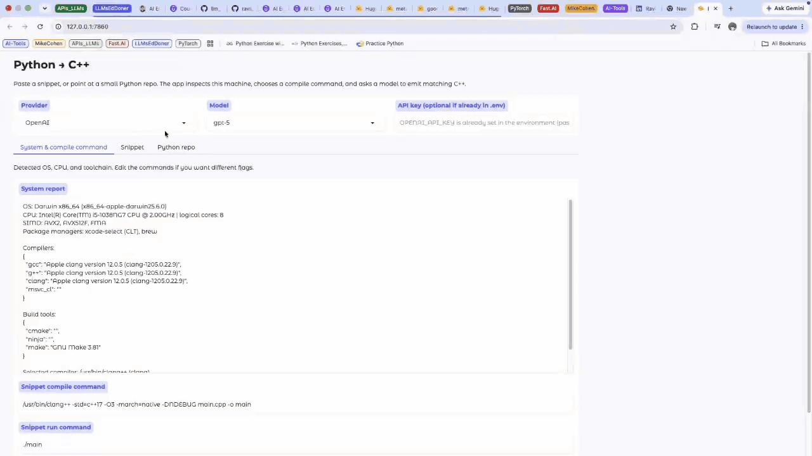

# CppLift

**CppLift** turns a Python snippet or a small Python repo into C++ with an LLM, then compiles and runs it on **this machine**.

The Gradio app lives in `Python_to_Cplus/`. Works on macOS, Linux, and Windows with Python 3.11+. A C++ compiler is only required if you click **Compile & run**.

The window is a studio that stays inside the browser. The left rail is the section list, in this order: **Models**, **Languages**, **Repo**, **Performance**, **System**. Zooming the browser reflows that layout: the rail wraps to the top on a tight window, editors stack, and each panel scrolls inside itself.

## What you need

1. **Python 3.11 or newer** (`python3 --version` / `py --version`). On macOS, `/usr/bin/python3` can still be 3.8 — use `python3.12` or `python3.11` if needed.
2. An **API key** for at least one cloud provider, **or** [Ollama](https://ollama.com) for local models
3. Optional, for compiling: a C++ toolchain
   - **macOS:** `xcode-select --install` (Apple Clang). Optional: `brew install cmake ninja`
   - **Linux (Debian/Ubuntu):** `sudo apt install -y build-essential cmake ninja-build`
   - **Linux (Fedora):** `sudo dnf install -y gcc-c++ cmake ninja-build`
   - **Windows:** Visual Studio Build Tools, LLVM, or MinGW-w64, plus CMake if you convert a repo

## Setup (all platforms)

Open a terminal in this folder (`Python_to_Cplus`).

### macOS / Linux

```bash
python3.12 -m venv .venv
# If 3.12 is missing: python3.11 -m venv .venv
source .venv/bin/activate
python -m pip install --upgrade pip
pip install -r requirements.txt
```

### Windows (Command Prompt)

```bat
py -3 -m venv .venv
.venv\Scripts\activate
python -m pip install --upgrade pip
pip install -r requirements.txt
```

### Windows (PowerShell)

```powershell
py -3 -m venv .venv
.\.venv\Scripts\Activate.ps1
python -m pip install --upgrade pip
pip install -r requirements.txt
```

If PowerShell blocks the activate script, run once:

```powershell
Set-ExecutionPolicy -Scope CurrentUser RemoteSigned
```

## API keys

Copy the example env file and fill in **only the providers you use**:

```bash
cp .env.example .env
```

On Windows (Command Prompt): `copy .env.example .env`

Supported providers: **OpenAI**, **Anthropic**, **Google Gemini**, **xAI Grok**, **Groq**, **OpenRouter**, and **Ollama (local)**.

You can also paste a key in the UI. The UI key overrides `.env` for that request and is not written to disk.

For live ranks on **Models**, set `ARTIFICIAL_ANALYSIS_API_KEY` (from [Artificial Analysis](https://artificialanalysis.ai)) or paste it in **Scores key**. Ranking still works from built-in estimates when that key is absent.

Ollama needs no cloud key.

## Run the app

With the virtual environment activated:

```bash
python app.py
```

Then open the URL Gradio prints (usually http://127.0.0.1:7860).

## User instructions

Open the URL Gradio prints. The app uses the full browser window.

| Area | What it is |
| --- | --- |
| Left rail | **Models**, **Languages**, **Repo**, **Performance**, **System**. **Appearance** (Light / Dark) is under the list. |
| Models | Cloud or Local, rank factor (output tokens, cost per run, latency, accuracy, or balanced), top 5, a typed run count, and a small quality-vs-cost chart. Hover a dot for every metric. |
| Languages | The same header as Repo (model and run count), then input language, output language, compiler commands when needed, and the two code panes. |
| Repo | The same header as Languages, then the folder or zip form. |
| Performance | A line per model. Hover a point for accuracy, latency, tokens, and cost, plus the KPI list. |
| Bottom bar | Shown on **Languages** and **Repo**, with the run actions. |

If you zoom in and the window is tight, the rail moves to the top as a wrapping list, the editors stack, and the action buttons wrap. Scroll inside the center or the bottom bar to reach anything that does not fit.

### 1. Pick a model

1. Open **Models**.
2. Choose **Cloud** or **Local**.

**Cloud**

1. Set **Provider** (OpenAI, Anthropic, Google Gemini, xAI Grok, Groq, or OpenRouter).
2. Set **Model**. If the list looks stale, click **Refresh catalog** (does not run at startup). Retired ids are dropped; the log says what is still working today.
3. Leave **API key** empty if the matching variable is already in `.env`. Paste a key only to override for this session. UI keys are not saved to disk.

3. Set **Rank by** (balanced, output tokens, cost per run, latency, or accuracy) and type **Runs** (1–10).
4. Click **Show top 5**. The chart plots those five. Hover a dot for score, accuracy, latency, tokens, and cost.
5. Leave every box checked and click **Use all**, or uncheck some and click **Use selected**. **Evaluate** runs only the checked models. Open **Performance** for the line chart.

**Local**

1. Click **Local**. CppLift probes Ollama, shows this machine’s RAM, and lists models already on disk in **Model**.
2. Pick a model in **Download this local model**.
3. Click **Download & use**. Watch the progress panel. If you need to cancel, click **Stop download & clean** (that also deletes the incomplete pull).
4. When it is ready, **Model** lists the downloaded model and Convert needs no cloud key. If Ollama is missing, follow the install hint in the panel, then run `ollama serve`.

The line under the dropdowns is the **token bar**: context-window size for the selected model. After a conversion it also shows prompt/completion tokens, latency, and estimated $ (local Ollama is $0).

### 2. Languages and code

1. Open **Languages**. The strip under the title is the model, the language pair, and the run count from **Models**.
2. Set **Input language** and **Output language**.
3. If the output needs a compiler (C, C++, Rust, Go, Java), edit **Compile command** and **Run command**. Python and JavaScript hide that block.
4. Edit the input on the left (a Python sample is already there). Converted code appears on the right.
5. In the bottom bar, set **Action** to **Convert** and click **Run**. Status shows **Converting…**, then **Done** with the token/cost line.
6. Optional actions in the same dropdown:
   - **Run input** — execute the left pane.
   - **Compile & run** — compile with the command on this page, then run it.
   - **Compare** — run Python and C++, then show timing plus last-convert tokens / latency / $.
   - **Stop** — cancel convert, input, or output that is still running so you can edit and try again.

If compile fails, CppLift sends the compiler log back to the same model (up to 4 repair passes), writes a successful fix into `generated/repair_memory.json`, and retries. Later compiles can reuse that memory.

### 3. Convert a small Python repo

1. Open **Repo**. The header matches **Languages** (same model, languages, and run count).
2. Enter a local folder path, or upload a `.zip`.
3. Click **Convert repo**. Output is `generated/cpp_project` (`CMakeLists.txt` + `src/`). Very large trees are truncated so the prompt fits the model context.
4. Click **Build & run** to configure/build (CMake when available, otherwise a direct compiler line) and run the binary. **Stop run** cancels that job.

From a terminal, after a successful build:

```bash
cd generated/cpp_project
./app
```

Rebuild after you edit the C++:

```bash
clang++ -std=c++17 -O3 -o app src/main.cpp
./app
```

On Windows the binary is `app.exe`. With CMake: `cmake -S . -B build && cmake --build build`, then run `build/app` (or `build/Release/app.exe` on MSVC).

Interactive programs (games, prompts) work best from this terminal, not from the Gradio log box.

### 4. Check the toolchain (System)

1. Open **System**.
2. Read OS, CPU, SIMD, and detected compilers.
3. After installing a toolchain, click **Re-scan this machine**. Compile and run commands for the current output language are on **Languages**.

### 5. Read the KPIs (Performance)

1. On **Models**, rank a top 5 and click **Evaluate**.
2. Open **Performance**.
3. The line chart is one line per model. Hover a point for accuracy, latency, tokens, and cost. Switch **Chart metric** or click **Export CSV**.

### Typical first run

1. `python app.py` → open http://127.0.0.1:7860
2. **Models** → **Cloud** or **Local** → **Show top 5** → **Use all** or **Use selected**
3. **Languages** → input and output, then the editors → **Convert** → **Run**
4. **Performance** after **Evaluate**, or **Repo** → folder or zip → **Convert repo** → **Build & run** / `./app`

## Layout

| File | Role |
| --- | --- |
| `app.py` | Gradio studio UI (left rail, models, languages and code, repo, performance) |
| `compiler.py` | Detect toolchain and pick compile commands |
| `converter.py` | Provider clients, Python → C++ prompts, usage stats |
| `model_catalog.py` | Live model lists, Ollama probe/pull, Scores / Suggest |
| `research.py` | Token/cost line and compile-error repair memory |
| `runner.py` | Stream subprocess output and **Stop** |
| `generated/` | Written C++ (`main.cpp` or a CMake `cpp_project`) |

## Troubleshooting

- **No API key** — set the matching variable in `.env` or paste it on **Models**.
- **No compiler** — install one using the hints on **Languages** or **System**, then **Re-scan this machine**.
- **Ollama connection error** — on **Models**, click **Local**. If Ollama is not installed, follow the download hint. If it is installed, run `ollama serve`, pick a model, then **Download & use**.
- **Windows `cl` not found** — open “x64 Native Tools Command Prompt for VS” (or equivalent) before `python app.py`, or use `clang++` / MinGW `g++` instead.
- **Permission / venv issues** — delete `.venv` and recreate it with the commands above.

## 🎬 Demo

See **CppLift** in action:

<p align="center">
  
</p>

## 📜 License

This project is licensed under the MIT License. See the
[LICENSE](../LICENSE) file for details.
